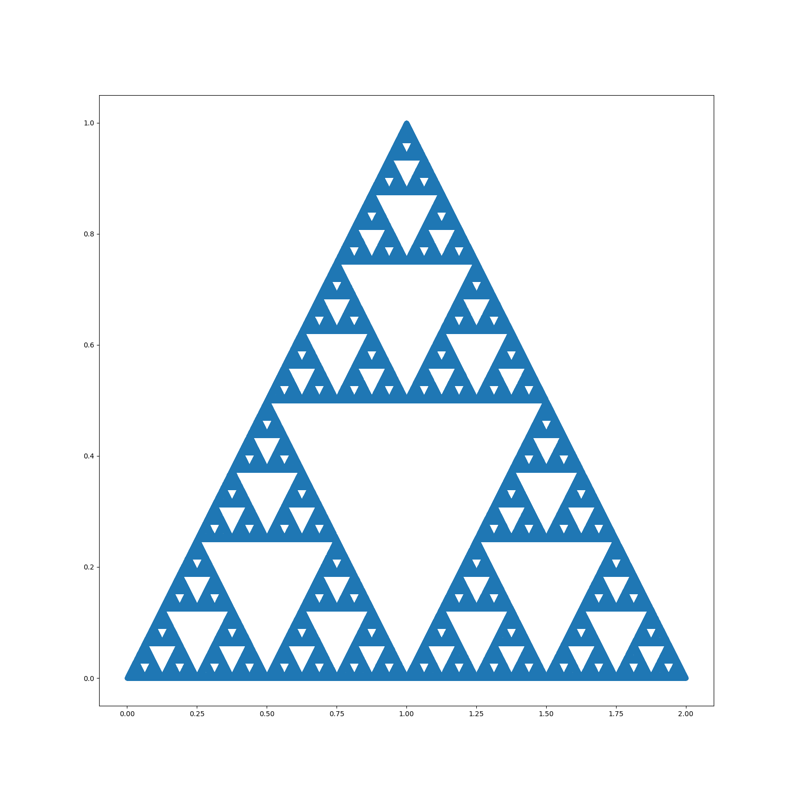

<h1>Sierpinski Triangles</h1>

This is a simple program in python that 
generates the number of triangles that the 
user determines. The following recursive 
transformations are used to achieve 
this:

 

<a href="https://www.codecogs.com/eqnedit.php?latex=\text{Note&space;that&space;}&space;x\&space;\text&space;{and&space;}&space;y&space;\&space;\text{is&space;already&space;provided.}\\\\&space;Transformation&space;1:&space;\\&space;x_1&space;=&space;0.5x&space;\\&space;y_1&space;=&space;0.5y\\\\&space;Transformation&space;2:&space;\\&space;x_2&space;=&space;0.5x&space;&plus;&space;0.5\\&space;y_2&space;=&space;0.5x&space;&plus;&space;0.5\\\\&space;Transformation&space;3:&space;\\&space;x_3&space;=&space;0.5x&space;&plus;&space;1\\&space;y_3&space;=&space;0.5y" target="_blank"></a>

Here is a render of the triangle generated: <\p>

